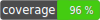

# Russian Federation vat format validator



This component provides Russian Federation vat number format validator.

Implementation of interface **rocketfellows\CountryVatFormatValidatorInterface\CountryVatFormatValidatorInterface**

Depends on https://github.com/rocketfellows/country-vat-format-validator-interface

## Installation

```shell
composer require rocketfellows/ru-vat-format-validator
```

## Usage example

Valid Russian Federation vat number:

```php
$validator = new RUVatFormatValidator();
$validator->isValid('1234567848');
$validator->isValid('770970230389');
```

Returns:

```shell
true
true
```

Invalid Russian Federation vat number:

```php
$validator = new RUVatFormatValidator();
$validator->isValid('1234567841');
$validator->isValid('770970230381');
$validator->isValid('RU1649041321');
$validator->isValid('RU164904132111');
$validator->isValid('1649041320280');
$validator->isValid('16490413202');
$validator->isValid('164904132');
$validator->isValid('');
```

```shell
false
false
false
false
false
false
false
false
```

## Contributing

Welcome to pull requests. If there is a major changes, first please open an issue for discussion.

Please make sure to update tests as appropriate.
